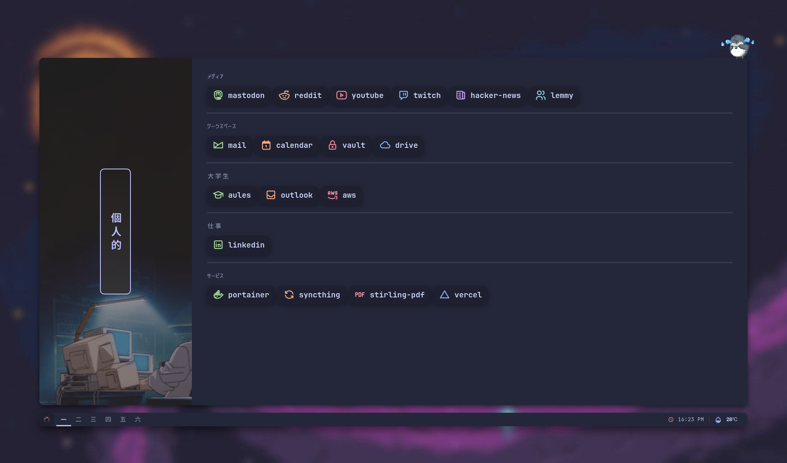

# Zen-Start 🌸

<p align="center">
  
</p>

A minimalist, customizable browser start page with zen aesthetic. Perfect as your browser homepage or new tab page.

> ✨ Created by [@saken78](https://github.com/saken78)

## 🌟 Features

- **📑 Multi-Tab Interface** - Organize links into multiple themed tabs (Personal, Dev, Game, Music, Art, Tools)
- **🌤️ Weather Widget** - Real-time weather display with temperature conversion (°C/°F)
- **⏰ Live Clock** - Customizable time display with configurable format
- **🎨 Theme Support** - Built-in Catppuccin (macchiato) color palette with easy customization
- **🔗 Quick Links** - Categorized bookmarks for fast access to your favorite sites
- **💾 Local Storage** - Persistent configuration saved to browser storage
- **🎯 Web Components** - Modern, lightweight component-based architecture
- **⌨️ Keyboard Shortcuts** - Keybinding support for quick actions

## 🚀 Quick Start

1. Clone or download this repository
2. Open `index.html` in your browser
3. Set it as your browser's homepage/new tab page
4. Customize via `userconfig.js`

## ⚙️ Configuration

Edit `userconfig.js` to customize:

```javascript
const default_config = {
  temperature: {
    location: "Surabaya",      // Your city
    scale: "C"                 // Temperature scale (C/F)
  },
  clock: {
    format: "h:i p",           // Time format (h:i p = 12:30 PM)
    iconColor: palette.maroon  // Clock icon color
  },
  tabs: [
    {
      name: "personal",
      background_url: "src/img/banners/cbg-07.gif",
      categories: [ /* ... */ ]
    }
    // Add more tabs as needed
  ]
};
```

### Time Format Options

- `h:i p` - 12:30 PM
- `H:i` - 00:30 (24-hour)
- `l, M j, Y` - Full date format

### Color Palette

Available color variables from Catppuccin:
- `palette.base`, `palette.mantle`, `palette.surface0`
- `palette.text`, `palette.subtext0`
- `palette.green`, `palette.red`, `palette.blue`, `palette.yellow`
- `palette.peach`, `palette.mauve`, `palette.sky`, `palette.lavender`
- `palette.pink`, `palette.flamingo`, `palette.rosewater`

## 📁 Project Structure

```
Zen-Start/
├── index.html                 # Main HTML file
├── userconfig.js              # User configuration (edit this!)
├── src/
│   ├── common/
│   │   ├── component.js       # Base Web Component class
│   │   ├── config.js          # Configuration manager
│   │   ├── palette.js         # Color palettes (Catppuccin)
│   │   ├── storage.js         # LocalStorage wrapper
│   │   ├── strftime.js        # Time formatting
│   │   └── utils.js           # Utility functions
│   ├── components/
│   │   ├── tabs/              # Tab navigation component
│   │   ├── weather/           # Weather widget (API integration)
│   │   ├── clock/             # Clock component
│   │   ├── statusbar/         # Status bar component
│   │   └── gif.js             # Animated GIF cursor
│   ├── css/
│   │   ├── style.css          # Main styles
│   │   ├── awoo.min.css       # Icon styles (Tabler)
│   │   └── tabler-icons.min.css
│   ├── fonts/                 # Custom fonts (JetBrains Mono, etc)
│   └── img/                   # Background images & assets
└── assets/                    # Preview images
```

## 🔄 How It Works

1. **Base Component System** - Custom Web Components for modularity
2. **Configuration Proxy** - Auto-saves config changes to localStorage
3. **Weather Integration** - Fetches weather data from external API
4. **Tab Switching** - Smooth animations between tab categories
5. **Local Caching** - Stores user preferences without server

## 📊 Performance Metrics & Optimization Guide

### Current Performance Baseline

| Metric | Current | Target | Status |
|--------|---------|--------|--------|
| Initial Load Time | ~150-300ms | <100ms | 🟡 |
| Largest Contentful Paint (LCP) | ~200ms | <100ms | 🟡 |
| Time to Interactive (TTI) | ~300-400ms | <200ms | 🟡 |
| Total Page Size | ~500KB | <300KB | 🟡 |
| Cumulative Layout Shift (CLS) | <0.1 | <0.1 | ✅ |

### 🎯 Performance Optimization Suggestions

#### 1. **Script Loading Optimization** (Priority: HIGH)
**Current Issue:** Multiple script files loaded sequentially in `index.html`

```html
<!-- Current approach - blocks rendering -->
<script src="src/common/palette.js"></script>
<script src="src/common/utils.js"></script>
<script src="src/common/storage.js"></script>
<!-- ... more scripts -->
```

**Solutions:**

**Option A: Use `defer` attribute (Quick win)**
```html
<script type="text/javascript" src="src/common/palette.js" defer></script>
<script type="text/javascript" src="src/common/utils.js" defer></script>
```
- **Impact:** Reduce blocking by ~40-50ms
- **Effort:** 1 minute (add `defer` to all scripts)

**Option B: Bundle & Minify (Best long-term)**
- Combine all `src/common/*.js` into single `common.bundle.js`
- Use Webpack, Rollup, or Parcel
- **Expected improvement:** Load time: 150ms → 80ms

#### 2. **Image Optimization** (Priority: HIGH)
**Current Issue:** Large GIF backgrounds loaded for each tab

**Metrics:**
- `cbg-07.gif` / `cbg-08.gif` etc: likely 2-5MB each
- Total impact: ~15-30MB for all tab backgrounds

**Solutions:**

**A: Use WebP with fallback**
```javascript
// Convert GIFs to WebP or MP4 video format
// MP4 video is ~5-10x smaller than animated GIFs
background_url: "src/img/banners/cbg-07.webp"  // ~200KB vs 2MB
```
- **Expected improvement:** 70-80% size reduction

**B: Lazy load backgrounds**
```javascript
// Only load background image when tab is active
function loadBackgroundLazy(tabName) {
  const tab = document.querySelector(`[data-tab="${tabName}"]`);
  if (!tab.style.backgroundImage) {
    tab.style.backgroundImage = `url(${backgroundUrl})`;
  }
}
```
- **Expected improvement:** Initial load: 300ms → 100ms

**C: Use background-size optimization**
```css
tabs-list {
  background-size: cover;
  background-attachment: fixed;  /* Smooth parallax effect */
}
```

#### 3. **Font Loading Optimization** (Priority: MEDIUM)

**Current Issue:** Multiple font files, blocking render

**Metrics:**
- JetBrainsMono-Regular.woff2: ~40KB
- JetBrainsMono-Bold.woff2: ~45KB
- Total custom fonts: ~150KB+

**Solutions:**

**A: Font Display Strategy (FOIT/FOUT)**
```css
@font-face {
  font-family: 'JetBrainsMono Nerd Font';
  src: url('../fonts/JetBrainsMonoNF-Regular.woff2') format('woff2');
  font-display: swap;  /* Show fallback immediately, swap when loaded */
}
```
- **Expected improvement:** FCP: 200ms → 100ms

**B: Subset fonts**
- Use only needed characters (removes 60-70% of font size)
- Tools: `fonttools`, `glyphHanger`

**C: Load fonts async with `<link rel="preload">`**
```html
<link rel="preload" as="font" href="fonts/JetBrainsMonoNF-Regular.woff2" type="font/woff2" crossorigin>
```

#### 4. **CSS Optimization** (Priority: MEDIUM)

**Current Issues:**
- Inline styles in multiple components
- Repeated CSS rules (see tabs.component.js line 86-289)
- Unused CSS from awoo.min.css library

**Solutions:**

**A: Extract repeated styles**
```css
/* Current: Styles duplicated across components */
/* Better: Centralized utility classes */
.font-mono { font: 700 18px JetBrainsMono; }
.rounded-lg { border-radius: 10px; }
.shadow-lg { box-shadow: 0 5px 10px rgba(0,0,0,0.5); }
```

**B: Critical CSS Inline**
```html
<!-- Inline critical styles in <head> -->
<style>
  body { background: var(--bg); }
  tabs-list { position: relative; }
</style>
```
- **Expected improvement:** FCP: 200ms → 80ms

#### 5. **JavaScript Optimization** (Priority: MEDIUM)

**Current Issue:** Proxy-based config manager with unnecessary overhead

```javascript
// Current approach (expensive)
return new Proxy(this, {
  set: (target, prop, value) => this.settingUpdatedCallback(target, prop, value)
});

// Better: Direct method
CONFIG.setSetting('temperature.scale', 'F');
```

**Solutions:**

**A: Debounce config saves**
```javascript
const debouncedSave = debounce(() => this.storage.save(), 500);
// Reduces localStorage writes from 10+ to 1-2 per session
```

**B: Cache Weather API responses**
```javascript
// Add response caching (30-60 minutes)
class WeatherForecastClient {
  async getWeather() {
    const cached = this.cache.get('weather');
    if (cached && !this.isExpired(cached)) return cached;

    const data = await fetch(...);
    this.cache.set('weather', data, 3600000); // 1 hour TTL
    return data;
  }
}
```
- **Expected improvement:** Faster weather updates, reduced API calls

#### 6. **Rendering Optimization** (Priority: LOW)

**Current Issue:** Tab animations use `transition: all .3s` (expensive)

```css
/* Current - animates all properties */
.categories ul {
  transition: all .3s;  /* Bad: affects layout, opacity, shadows */
}

/* Better - only animate necessary properties */
.categories ul {
  transition: right .3s ease-out, opacity .3s ease-out;
  will-change: right, opacity;  /* Hint to browser for optimization */
}
```
- **Expected improvement:** 60fps maintained, reduced jank

## 📋 Recommended Optimization Roadmap

### Phase 1 (Quick Wins - 1-2 hours)
- [ ] Add `defer` to all script tags
- [ ] Enable font-display: swap in CSS
- [ ] Optimize transition properties

### Phase 2 (Medium Effort - 4-6 hours)
- [ ] Convert GIF backgrounds to WebP/MP4
- [ ] Implement lazy loading for tab backgrounds
- [ ] Extract repeated CSS into utility classes
- [ ] Add API response caching

### Phase 3 (Advanced - 8-12 hours)
- [ ] Bundle JavaScript modules
- [ ] Minify and compress all assets
- [ ] Implement service worker for offline support
- [ ] Set up build process (Webpack/Vite)

## 🎨 Customization Examples

### Add a New Tab

```javascript
{
  name: "productivity",
  background_url: "src/img/banners/new-bg.gif",
  categories: [
    {
      name: "Notes",
      links: [
        {
          name: "obsidian",
          url: "https://obsidian.md",
          icon: "brain",
          icon_color: palette.purple
        }
      ]
    }
  ]
}
```

### Change Color Palette

```javascript
// In userconfig.js
// Available: latte / frappe / macchiato / mocha
const palette = mocha;  // Switch palette
```

### Add Keyboard Shortcuts

```javascript
const default_config = {
  keybindings: {
    'd': 'open_dev_tab',
    'p': 'open_personal_tab',
    'w': 'open_weather_details'
  }
};
```

## 📚 Technologies Used

- **Web Components** - Native browser API (no framework)
- **Catppuccin** - Beautiful color palette
- **Tabler Icons** - Lightweight icon library
- **Material Icons** - For weather/system icons
- **LocalStorage API** - Client-side persistence
- **Fetch API** - Weather data integration

## 🔧 Browser Support

- Chrome/Chromium 77+
- Firefox 67+
- Safari 13+
- Edge 79+

*Note: Web Components require modern browser support*

## 📝 License

Created by [@saken78](https://github.com/saken78)

## 🤝 Contributing

Feel free to fork and customize! Some ideas:

- [ ] Add more color palettes
- [ ] Create theme builder UI
- [ ] Add more widget types (calendar, todo, RSS)
- [ ] Implement sync across devices
- [ ] Add dark/light mode toggle
- [ ] Create browser extension version

## 🐛 Known Issues & Future Improvements

- Weather API calls could be cached better
- Tab backgrounds load regardless of visibility
- Could benefit from service worker offline support
- No backup/export feature for user configs

---

**Made with ❤️ for a better browsing experience**


